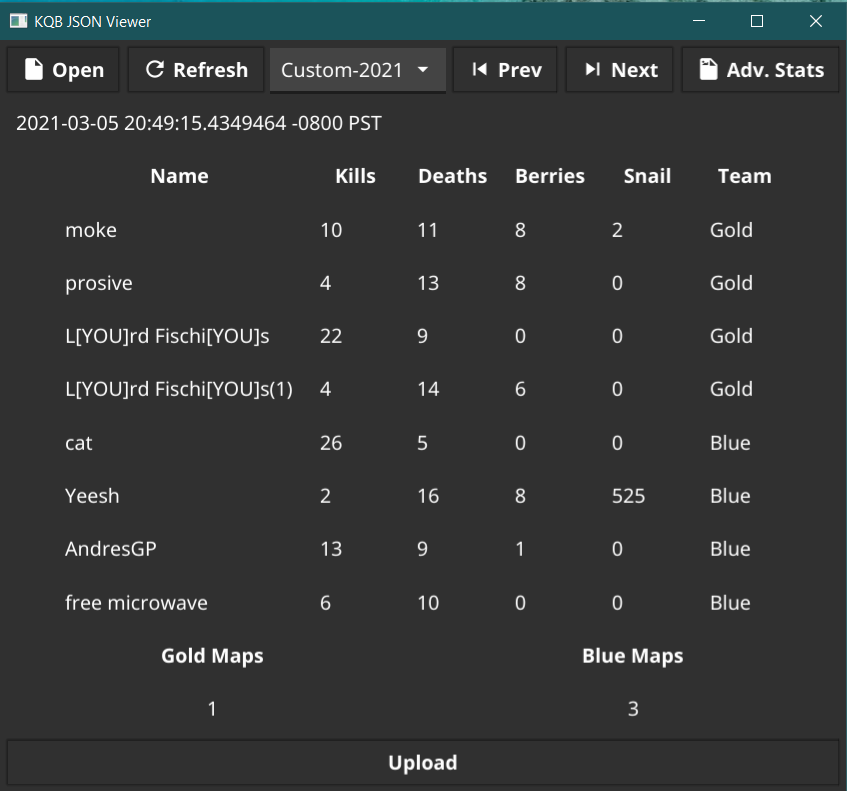
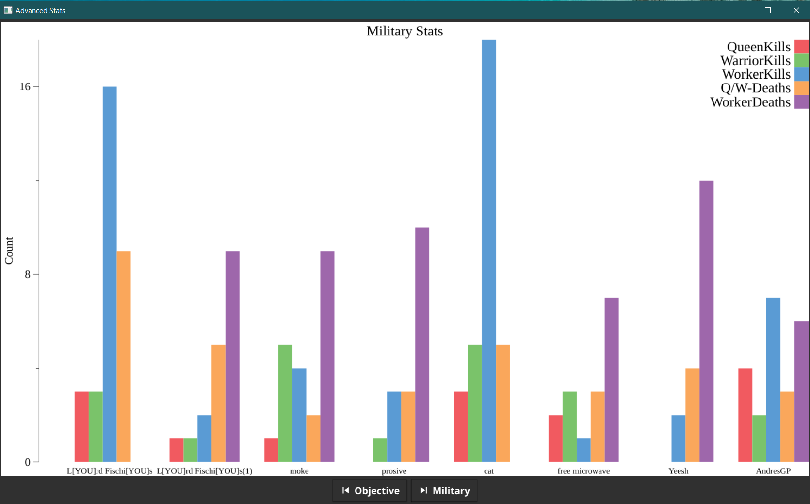
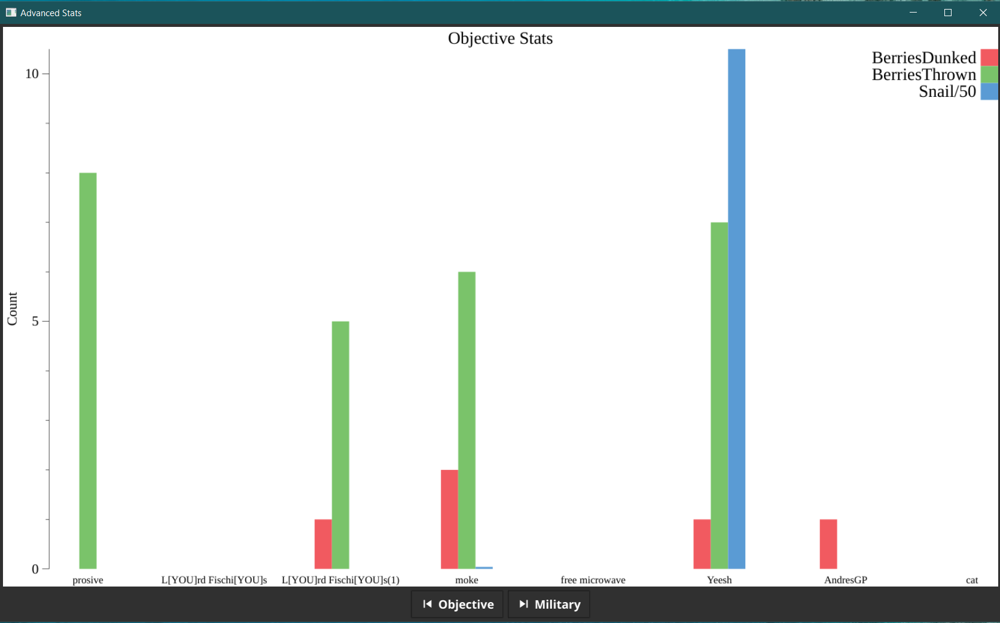

# KQB JSON Stats Viewer

This app is meant to help you view the json stats you have stored locally. 

It provides an easy way to see at a glance stats, and to view some advanced charts as well. 

## Known Issues
This is beta software and may have issues. You have been warned. 

> **Note:**  The app will crash if you do not have any stats files to read. You must either have them in your KQB stats folder, or if you are using json files from someone else, they must be in the same directory as the kqb-json-viewer app. The default directory on windows is `C:\Users\%USERPROFILE%\AppData\LocalLow\Liquid Bit, LLC\Killer Queen Black\match-stats`

> **Note:**  There is an issue with the UI Framework and G-Sync displays. If you have G-Sync enabled in windowed & full screen modes, please change it to full screen only. Otherwise the app UI may be very choppy for you. 

## How to Run

### Download From Releases
The easiest way to use this package is to download a pre-built release. Find the latest release for your operating system [here](https://github.com/achhabra2/kqb-json-viewer/releases). 

### Running Locally From Source
To run and build locally you will need to have [Golang](https://golang.org/dl/) already installed. The rest is pretty straightforward. 
```
git clone https://github.com/achhabra2/kqb-json-viewer.git
cd kqb-json-viewer
go run .
```

### Building Locally From Source
Requires gcc compiler.  For Windows use [MinGW](http://www.mingw.org/).
```
git clone https://github.com/achhabra2/kqb-json-viewer.git
cd kqb-json-viewer
go build .
go get fyne.io/fyne/v2/cmd/fyne
```

Then according to your operating system run this: 
```
fyne package -os windows -icon logo.png
fyne package -os darwin -icon logo.png
```

## Screenshots


