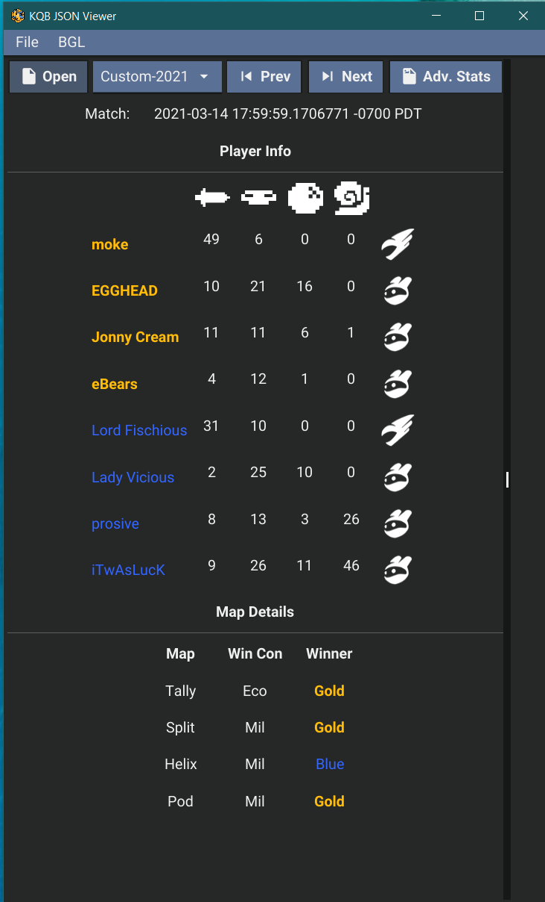

# KQB JSON Stats Viewer

This app is meant to help you view the json stats you have stored locally. 

It provides an easy way to see at a glance stats, and to view some advanced charts as well. 

## How to Run

### Download From Releases
The easiest way to use this package is to download a pre-built release. Find the latest release for your operating system [here](https://github.com/achhabra2/kqb-json-viewer/releases). 

### Running Locally From Source
To run and build locally you will need to have Golang already installed. The rest is pretty straightforward. 
```
git clone https://github.com/achhabra2/kqb-json-viewer.git
cd kqb-json-viewer
go run .
```

### Building Locally From Source
```
git clone https://github.com/achhabra2/kqb-json-viewer.git
go build .
go get fyne.io/fyne/v2/cmd/fyne
```

Then according to your operating system run this: 
```
fyne package -os windows -icon logo.png
fyne package -os darwin -icon logo.png
```

## Screenshots


